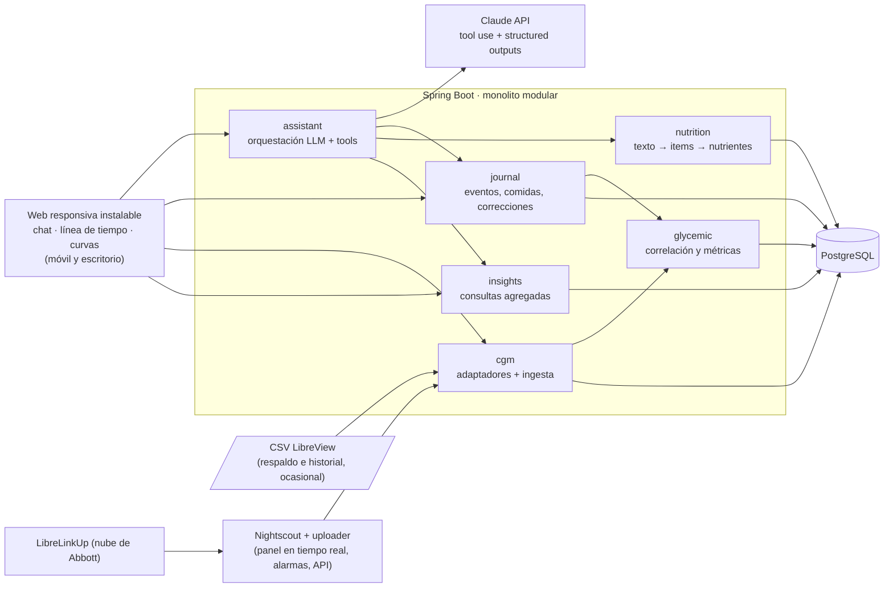
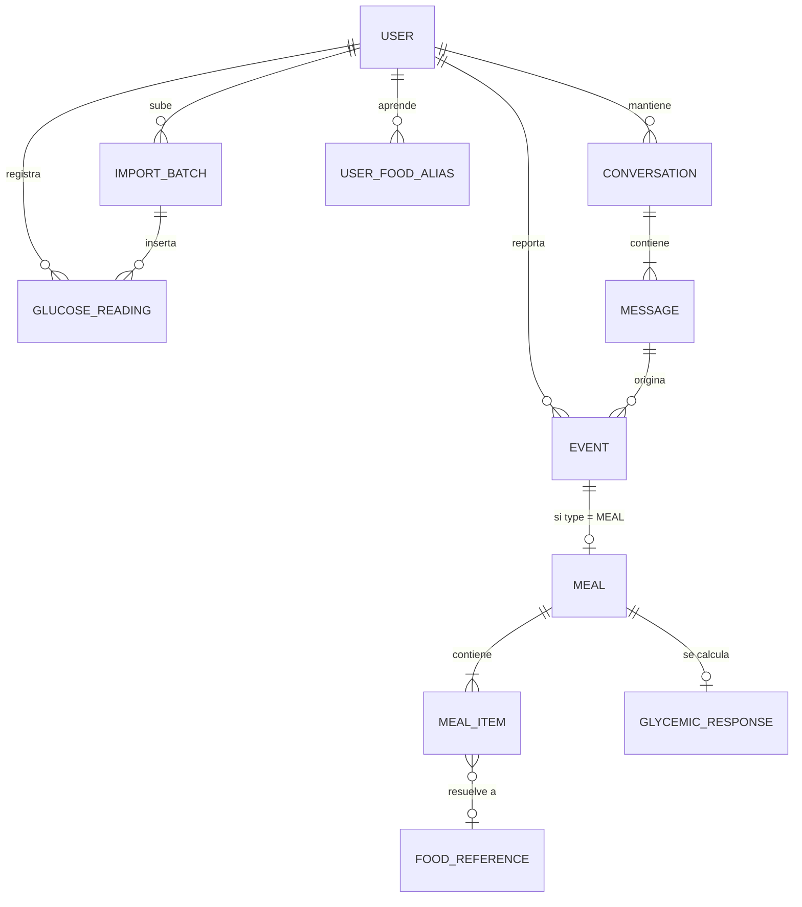

# Glucurvia — Diseño del MVP

Versión 0.5.1 · 13 de septiembre de 2026 · MVP de uso personal en Ciudad de México, móvil primero, glucosa casi en tiempo real con Nightscout como capa de ingesta. Lo recortado para uso personal está en el apéndice (sección 14) y los cambios en la 15.

## 0. Principios que gobiernan el diseño

| Principio | Consecuencia concreta en el diseño |
|---|---|
| Uso personal primero | Un usuario (el autor), quizá dos o tres conocidos. Todo lo que resuelve problemas de una empresa con usuarios (registro, cumplimiento, cifrado, cuotas) va al apéndice, no al MVP. |
| Conversación, no formularios | Todo lo que el usuario dice entra como texto libre y se convierte en eventos estructurados. Máximo una pregunta de aclaración por mensaje, y solo si cambia mucho el resultado. |
| Observación ≠ estimación ≠ inferencia | Cada dato lleva su tipo epistémico en el modelo (lectura medida, nutriente estimado con rango, métrica derivada con calidad, inferencia narrativa con n). El agente responde con esa misma separación, dosificada según el tipo de pregunta. |
| El LLM interpreta y narra; nunca calcula ni decide | Las métricas glucémicas, las comparaciones, la confianza de las estimaciones y la política de aclaración se calculan en Java/SQL con versión. El LLM recibe números y los explica. |
| CGM desacoplado y casi en tiempo real | Un puerto `CgmSourceAdapter` con tres implementaciones en el MVP: Nightscout (pull local cada minuto y en cada mensaje; Nightscout a su vez recibe de LibreLinkUp mediante un uploader de la comunidad), CSV de LibreView (respaldo e historial) y manual. Otros fabricantes son adaptadores futuros. |
| Sin sobreingeniería | Monolito en Spring Boot, una sola PostgreSQL, sin colas ni microservicios. Nightscout se opera como producto ya hecho, no como código propio. Se añade infraestructura solo cuando una medición lo justifique. |
| No es un médico | Sin diagnóstico, sin dosis, sin umbrales clínicos como veredicto. Analiza patrones del propio usuario. Es una regla de diseño y de prompt, no un análisis legal. |
| Móvil primero | Se usa desde el teléfono: se registra la comida y la curva llega sola en minutos. El CSV solo se sube de vez en cuando, desde el ordenador, como respaldo. |

---

## 1. Arquitectura de alto nivel



### 1.1 Decisiones y por qué

| Decisión | Elección MVP | Razón |
|---|---|---|
| Forma del backend | Monolito modular: un módulo Maven por dominio, con `core` como único módulo compartido (tipos, puertos, eventos) y `api` cableando el resto; ver `docs/plan-trabajo-paralelo.md` | Un despliegue y transacciones simples; el build impone las fronteras entre módulos, lo que permite que varios agentes en dos máquinas trabajen en paralelo sin pisarse. |
| Bordes hexagonales | Solo en tres puertos: `CgmSourceAdapter`, `LlmGateway`, `FoodCatalog` | Son los tres puntos con proveedores externos o intercambiables. El resto es código normal. |
| Lecturas casi en tiempo real | Nightscout como capa de ingesta: su uploader lee de LibreLinkUp cada minuto y nuestra app lee de la API de Nightscout cada minuto y en cada mensaje del chat; CSV solo como respaldo | Ver 4.4. La parte frágil (la API no oficial de Abbott) la mantiene la comunidad; la API de Nightscout es estable desde hace años; el panel en tiempo real y las alarmas vienen gratis. Si algo se rompe, el CSV recupera el hueco. |
| Base de datos | PostgreSQL 17, una instancia, `docker-compose` en local y un VPS pequeño o gestionado barato para "producción personal" | Ver 1.3. Sin particionado ni TimescaleDB: con 100–300 mil lecturas al año la tabla plana sirve la consulta caliente en menos de un milisegundo durante décadas. |
| Trabajo asíncrono | `@Async` + recomputación idempotente + un `@Scheduled` reconciliador | La única tarea pesada es recomputar respuestas glucémicas tras un import. |
| LLM | Claude vía SDK Java, tras el puerto `LlmGateway` | Structured outputs con esquema derivado de records Java; tool use con `strict: true` para argumentos válidos. |
| Modelo | `claude-opus-5` para chat, análisis y extracción | Un solo modelo simplifica prompts, caché y evaluación. Medir `claude-sonnet-5` en extracción cuando exista el set de 9.6. |
| Frontend | Web responsiva móvil-primero, instalable en pantalla de inicio (React + Vite + TypeScript) | Ver 1.4. |
| Usuarios y acceso | Una fila en `users` sembrada por Flyway (`America/Mexico_City`, `es-MX`); una contraseña única en Spring Security o Tailscale / Cloudflare Access delante | Sin registro, sin magic link, sin correo. `user_id` se conserva en las tablas porque cuesta 16 bytes por fila y quitarlo costaría una migración completa el día que entre un conocido. |
| Observabilidad | Logs estructurados, `tokens_in/out` y `prompt_version` por mensaje, tiempo y errores por tool | Controlar el gasto y depurar extracciones. |

### 1.2 Stack concreto

- Java 21, Spring Boot 3.x, Spring Data JPA para entidades de dominio, `JdbcTemplate` para las consultas de series.
- Flyway para migraciones. `pg_trgm` para búsqueda de alimentos sobre una columna `search_text` normalizada por la aplicación (`unaccent` no puede ir en un índice).
- SDK oficial `com.anthropic:anthropic-java`. Structured outputs vía `outputConfig(Clase.class)`; tools con esquema JSON estricto.
- Frontend: React + Vite + TypeScript, Recharts para la curva (300 puntos por ventana), `manifest.json` con `display: standalone`.
- Despliegue: un `docker-compose` con cinco servicios en el mismo host: la API, Postgres, Nightscout, su MongoDB y el uploader de LibreLinkUp. Propuesta: el iMac como servidor siempre encendido y la MacBook para desarrollar, con Tailscale para que el teléfono llegue desde cualquier sitio; `pg_dump` nocturno a otro destino (sección 13).

### 1.3 ¿SQL o NoSQL?

PostgreSQL, y no está cerca. El argumento no es "Postgres es seguro": es que esta carga **no tiene forma de serie temporal**. Un CSV semanal, 100–300 mil filas al año, 1,5 millones en cinco años; sin ingesta continua, sin retención por antigüedad, sin downsampling de millones de puntos. InfluxDB y TimescaleDB resuelven un problema que no existe aquí y no resuelven el otro 80 % del sistema. Y ese 80 % necesita cuatro cosas difíciles a la vez, que solo Postgres trae sin pegamento:

| Necesidad | En PostgreSQL | En las alternativas |
|---|---|---|
| Percentiles, medianas, IQR (rango personal, comparaciones) | `percentile_cont` nativo | MongoDB tiene `$percentile` desde 7.0, más torpe; SQLite no lo tiene sin extensión; Firestore no lo tiene. |
| Búsqueda difusa de alimentos en español ("abena", "hojuelas") | `pg_trgm` sobre `search_text` | MongoDB exige Atlas Search (gestionado); Firestore no la tiene. |
| Integridad referencial para revertir un lote de import con seguridad | FK + `on delete cascade` | Sin FK, la operación más peligrosa del sistema deja huérfanos silenciosos. |
| Atributos flexibles (`attributes`, `per_100g`) | JSONB | Es exactamente el modelo de documentos que se buscaría en Mongo, dentro de una base relacional. |

Descartes concretos: **Firestore** cobra por documento leído y cada recomputación lee ~300 lecturas, el patrón que peor le sienta. **MongoDB** no da nada que JPA + JSONB no den y quita las FK. **SQLite** es la única alternativa honesta para un usuario (cero servidor, copia de seguridad = copiar un archivo), pero pierde percentiles nativos, trigramas decentes con acentos y escritura concurrente mientras el `@Scheduled` recomputa; el ahorro es media hora de `docker-compose`. Si algún día una agregación se hiciera lenta, se exporta a Parquet y se corre en DuckDB. MongoDB aparece solo como dependencia interna de Nightscout (4.4): no es nuestra base de datos ni guarda nada que no esté ya en Postgres.

Simplificaciones de esquema que sí acepta el uso personal: sin tablas de credenciales, consentimientos ni idempotencia HTTP; sin particionado; una fila en `users`; la cadencia del sensor se detecta por lote en vez de configurarse por conexión.

### 1.4 Frontend móvil

Web responsiva móvil-primero, instalable con "Añadir a pantalla de inicio" (`manifest.json`, `display: standalone`), sin service worker al principio. Razones:

1. HealthKit ya está descartado para Libre (apéndice), y era la única razón real para ir a nativo. React Native/Expo cobraría su precio (EAS, perfiles, distribución) sin devolver nada.
2. Una sola base de código para teléfono y ordenador (el CSV de respaldo se sube desde el ordenador).
3. Offline no hace falta: sin servidor no hay chat ni curvas.

Con Nightscout como capa de ingesta, el teléfono lo hace todo: registras la comida y la curva aparece sola en cuestión de minutos. El panel en tiempo real del día y las alarmas son los de Nightscout; nuestra web enlaza a él desde la pantalla de inicio y no los duplica: se dedica al chat, la línea de tiempo y las curvas por comida. El CSV de LibreView pasa a ser un respaldo ocasional: se sube desde el ordenador para cargar el historial anterior a la app o si el uploader o Nightscout estuvieron caídos más de 12 horas. La subida móvil se mantiene porque cuesta un `<input>`.

Detalles que sí importan en 390 px: eje temporal relativo a la comida (−1 h … +4 h), no horas absolutas; el detalle "¿por qué este número?" como *bottom sheet*, no como columna lateral; el chat con la caja de texto fija abajo.

---

## 2. Modelo de dominio

### 2.1 Conceptos y su tipo epistémico

| Concepto | Tipo | Qué es |
|---|---|---|
| `GlucoseReading` | Observación | Una lectura del sensor en un instante, en mg/dL canónicos, con su tipo (histórica, escaneo, tiempo real, manual, tira). |
| `Event` | Observación + estimación de tiempo | Algo que el usuario reportó: comida, actividad, sueño, estrés, medicación, alcohol, síntoma, nota. Conserva el texto crudo y la zona horaria vigente. El instante puede ser exacto, aproximado o inferido. |
| `Meal` / `MealItem` | Estimación | Especialización de `Event`. Cada ítem tiene gramos y nutrientes como punto + rango + confianza (derivada en Java), con supuestos explícitos y versión del estimador. |
| `FoodReference` | Referencia | Catálogo de composición por 100 g con convención de hidratos explícita, alias en español de México y conversiones de medidas caseras. |
| `UserFoodAlias` | Aprendido | "Mi tostada" = 12 g de tostada de maíz horneada. Nace de correcciones del usuario. |
| `GlycemicResponse` | Derivado determinista | Métricas de una comida calculadas a partir de una sola familia de lecturas (`series_source`); llevan `algorithm_version`, `quality` y confusores. |
| `PersonalRange` | Derivado determinista | Percentiles del propio usuario en una ventana móvil de 14 días, calculados bajo demanda. Es el "rango habitual", no un objetivo clínico. |
| `Conversation` / `Message` | Observación + traza | Historial de chat con las llamadas a tools y sus resultados. |
| Respuesta del agente | Inferencia narrativa | Texto que separa observación, calidad, inferencia y, si se pide, hipótesis. No se persiste como hecho. |

### 2.2 Relaciones



### 2.3 Invariantes

1. Toda lectura se almacena en UTC con valor en mg/dL. La conversión a mmol/L y a hora local ocurre solo al presentar.
2. Todo evento conserva `raw_text`, la interpretación estructurada, la zona horaria vigente y la versión del intérprete. Reinterpretar es posible sin perder el original.
3. Los totales de una comida se derivan de sus ítems. Nunca se editan a mano.
4. Una `GlycemicResponse` sin `quality`, `algorithm_version` y `series_source` no existe. Recalcularla es idempotente.
5. Ninguna comparación mezcla respuestas con `series_source` distinto ni cadencias distintas.
6. El "rango habitual" se calcula del propio usuario. No hay umbral clínico escrito en el dominio.
7. Todo lote importado se puede revertir entero.

---

## 3. Entidades y tablas principales

DDL resumido. Se omiten `updated_at` y restricciones menores. Las FK desde `users` llevan `on delete cascade` porque no cuesta nada y evita huérfanos.

```sql
create table users (
  id            uuid primary key default gen_random_uuid(),
  display_name  text,
  timezone      text not null default 'America/Mexico_City',
  glucose_unit  text not null default 'MG_DL',           -- MG_DL | MMOL_L (solo presentación)
  locale        text not null default 'es-MX',
  preferences   jsonb not null default '{}',             -- horas típicas de comida, notas dietéticas
  created_at    timestamptz not null default now()
);  -- una fila sembrada por Flyway

create table import_batches (
  id                   uuid primary key default gen_random_uuid(),
  user_id              uuid not null references users(id) on delete cascade,
  source               text not null,    -- LIBREVIEW_CSV | MANUAL (los pulls de Nightscout no crean lote)
  source_name          text,             -- nombre de archivo
  content_hash         text,             -- sha256: rechaza el mismo archivo dos veces
  assumed_timezone     text not null,    -- zona con la que se convirtió la hora local del CSV
  detected_cadence_sec int,              -- 900 (Libre 2) o 300 (Libre 3), detectado en los datos
  device_serial        text,
  status               text not null,    -- RECEIVED | STORED | REVERTED | FAILED
  rows_total int, rows_inserted int, rows_duplicate int, rows_rejected int,
  range_start timestamptz, range_end timestamptz,
  warnings             jsonb not null default '[]',   -- filas rechazadas con su valor crudo y motivo
  error                text,
  created_at           timestamptz not null default now()
);

create table cgm_pull_state (              -- estado del sondeo a Nightscout; URL y token van en variables de entorno
  source               text primary key,     -- NIGHTSCOUT
  last_pull_at         timestamptz, last_reading_ts timestamptz,
  last_status          text, last_error text,
  consecutive_failures int not null default 0
);

create table glucose_readings (
  user_id          uuid not null references users(id) on delete cascade,
  ts               timestamptz not null,
  reading_type     smallint not null,   -- 0 HISTORIC | 1 SCAN | 2 REALTIME | 3 MANUAL | 4 STRIP (catálogo en código)
  value_mgdl       numeric(5,1) not null,
  is_clipped       boolean not null default false,  -- LO/HI del sensor (límites 40/500 en configuración)
  import_batch_id  uuid references import_batches(id),
  primary key (user_id, ts, reading_type)
);
create index on glucose_readings (import_batch_id);   -- necesario para revertir un lote

create table conversations (
  id uuid primary key default gen_random_uuid(),
  user_id uuid not null references users(id) on delete cascade,
  started_at timestamptz not null default now(),
  last_message_at timestamptz
);

create table conversation_messages (
  id                 uuid primary key default gen_random_uuid(),
  conversation_id    uuid not null references conversations(id) on delete cascade,
  client_message_id  uuid unique,       -- lo genera el cliente; un reintento del POST devuelve la respuesta ya guardada
  role               text not null,     -- USER | ASSISTANT | TOOL
  content            text,
  tool_calls         jsonb,             -- [{name, input, output_summary, ms, error}]
  model              text, prompt_version text,
  tokens_in int, tokens_out int,
  client_time        timestamptz,       -- hora del dispositivo del usuario al enviar
  created_at         timestamptz not null default now()
);

create table events (
  id                   uuid primary key default gen_random_uuid(),
  user_id              uuid not null references users(id) on delete cascade,
  type                 text not null,   -- MEAL | ACTIVITY | SLEEP | STRESS | MEDICATION | ALCOHOL | SYMPTOM | NOTE
  started_at           timestamptz not null,
  ended_at             timestamptz,
  local_tz             text not null,   -- zona vigente al crear el evento (por si se viaja)
  time_confidence      text not null,   -- EXACT | APPROX | INFERRED
  time_uncertainty_min int not null default 0,
  source               text not null,   -- CHAT | MANUAL | IMPORT
  raw_text             text,
  message_id           uuid references conversation_messages(id),
  attributes           jsonb not null default '{}',  -- datos por tipo (5.2)
  created_at           timestamptz not null default now(),
  deleted_at           timestamptz
);
create index on events (user_id, started_at desc) where deleted_at is null;
create index on events (user_id, type, started_at desc) where deleted_at is null;

create table food_references (
  id              uuid primary key default gen_random_uuid(),
  name            text not null,       -- "avena en hojuelas"
  aliases         text[] not null default '{}',  -- {"avena","hojuelas de avena","oats"}
  search_text     text not null,       -- name + aliases normalizados por la aplicación (sin acentos, minúsculas)
  category        text,                -- CEREAL | FRUTA | TORTILLA | LEGUMINOSA | ...
  source          text not null,       -- USDA_FDC | CURATED | LLM_FALLBACK
  source_notes    text,                -- p. ej. "contrastado con SMAE"
  per_100g        jsonb not null,      -- {"carbs_total":67.7,"fiber":10.1,"carbs_available":57.6,"carb_convention":"BY_DIFFERENCE","protein":13.2,"fat":6.5,"kcal":379}
  portions        jsonb not null default '{}',  -- {"cucharada copeteada":10,"taza":80,"pieza":12}
  density_g_ml    numeric(4,2),        -- líquidos
  locale_notes    jsonb not null default '{}'
);
create index on food_references using gin (search_text gin_trgm_ops);

create table meals (
  event_id            uuid primary key references events(id) on delete cascade,
  meal_type           text,            -- BREAKFAST | LUNCH | DINNER | SNACK
  carbs_g             numeric(6,1), carbs_low numeric(6,1), carbs_high numeric(6,1),   -- hidratos DISPONIBLES (sin fibra)
  fiber_g             numeric(6,1), protein_g numeric(6,1), fat_g numeric(6,1), kcal numeric(7,1),
  confidence          numeric(3,2),    -- 0–1, derivada en Java, ponderada por aporte de HC
  estimator_version   text not null,   -- prompt + catálogo + reglas, p. ej. "est-2026.09.1"
  estimated_at        timestamptz not null
);

create table meal_items (
  id                uuid primary key default gen_random_uuid(),
  meal_id           uuid not null references meals(event_id) on delete cascade,
  position          int not null,
  raw_description   text not null,     -- "4 cucharadas de avena"
  food_name         text not null,     -- "avena en hojuelas"
  preparation       text,              -- "cruda", "cocida", "frita", "horneada"
  food_ref_id       uuid references food_references(id),   -- null si no hubo match
  quantity          numeric(7,2), unit text,   -- 4, "cucharada copeteada"
  grams             numeric(7,1), grams_low numeric(7,1), grams_high numeric(7,1),
  volume_ml         numeric(7,1),      -- líquidos; los gramos se derivan con density_g_ml
  portion_eaten     numeric(3,2) not null default 1.0,   -- "dejé la mitad" → 0.5
  carbs_g           numeric(6,1), carbs_low numeric(6,1), carbs_high numeric(6,1),
  fiber_g           numeric(6,1), protein_g numeric(6,1), fat_g numeric(6,1), kcal numeric(7,1),
  confidence        numeric(3,2),      -- derivada en Java (10.1)
  llm_confidence    numeric(3,2),      -- autoevaluación del LLM; solo para evaluación, nunca para decidir
  macro_source      text not null,     -- CATALOG | USER_ALIAS | LLM_FALLBACK | LABEL
  assumptions       text[] not null default '{}',
  needs_clarification boolean not null default false
);

create table user_food_aliases (
  user_id      uuid not null references users(id) on delete cascade,
  alias        text not null,          -- "mi tostada", "la bebida de avena"
  food_ref_id  uuid references food_references(id),
  grams        numeric(7,1),
  per_100g     jsonb,                  -- producto concreto con etiqueta
  learned_from uuid,                   -- meal_item que originó la corrección
  primary key (user_id, alias)
);

create table glycemic_responses (
  meal_event_id        uuid primary key references meals(event_id) on delete cascade,
  algorithm_version    text not null,
  computed_at          timestamptz not null,
  series_source        text not null,     -- REALTIME | HISTORIC: única familia de lecturas usada
  cadence_sec          int not null,
  scan_fraction        numeric(4,3),      -- fracción de puntos rellenados con SCAN
  quality              text not null,     -- GOOD | PARTIAL | CONFOUNDED | INSUFFICIENT
  coverage_pct         numeric(5,2),      -- lecturas reales ÷ esperadas según cadencia
  max_gap_min          int,
  baseline_mgdl        numeric(5,1), baseline_n int, baseline_unstable boolean,
  peak_mgdl            numeric(5,1), peak_at timestamptz, time_to_peak_min int, delta_peak_mgdl numeric(5,1),
  g30 numeric(5,1), g60 numeric(5,1), g90 numeric(5,1), g120 numeric(5,1), g180 numeric(5,1),
  return_to_baseline_min int,            -- null si no vuelve o si no hubo excursión
  iauc_window_start    timestamptz,
  iauc_0_120           numeric(8,1),     -- mg/dL·min, solo área positiva
  iauc_0_180           numeric(8,1),
  max_rise_rate        numeric(5,2),     -- mg/dL por minuto, acotada por la cadencia
  max_fall_rate        numeric(5,2),
  minutes_above_personal_p90 int,
  personal_p90_mgdl    numeric(5,1),     -- el p90 usado, para reproducibilidad
  personal_range_period_end date,
  window_end           timestamptz,
  flags                text[] not null default '{}',   -- IN_PROGRESS, PEAK_AT_EDGE, TRUNCATED_BY_NEXT_MEAL, NO_EXCURSION, ...
  context_tags         text[] not null default '{}',   -- ACTIVITY_AFTER, ALCOHOL, POOR_SLEEP, ...
  confounder_event_ids uuid[] not null default '{}'
);
create index on glycemic_responses using gin (context_tags);
```

Lo que se mantiene a propósito aunque sea uso personal: `user_id`, `on delete cascade`, `deleted_at`, `estimator_version`, `algorithm_version`, `tokens_in/out`, `prompt_version`. Son columnas gratis que hacen posible recomputar, deshacer y controlar el gasto. Lo que se quitó respecto a la versión 0.2 está en el apéndice.

---

## 4. Modelo para lecturas CGM

### 4.1 La tabla

- Sin id sintético: la PK natural `(user_id, ts, reading_type)` es el índice que sirve el 100 % de las consultas (rango de tiempo por usuario) y hace la ingesta idempotente con `insert … on conflict do nothing`.
- `reading_type` separa lecturas históricas (cada 15 min en Libre 2; cada 5 min en Libre 3), escaneos manuales, tiempo real (las que llegan por Nightscout: `sgv` cada minuto), manuales y de tira (`mbg` de Nightscout). Un escaneo y una histórica pueden coincidir en el mismo minuto con valores distintos: ambas se guardan. La cadencia nominal de cada familia (intervalo del uploader para tiempo real; `detected_cadence_sec` del lote para el CSV) la necesita el algoritmo para medir cobertura (6.1, paso 0).
- `value_mgdl` canónico. mmol/L × 18,0182 al importar; mg/dL ÷ 18,0182 al mostrar.
- `is_clipped`: Libre reporta `LO` por debajo de 40 y `HI` por encima de 500 mg/dL (algún modelo usa 400; los límites viven en configuración). Se guardan como el límite con la marca, y el algoritmo los excluye de picos, pendientes y percentiles.

### 4.2 Consultas típicas

```sql
-- Curva para una comida (ventana −60 / +240 min), la única consulta caliente.
select ts, value_mgdl, reading_type, is_clipped
from glucose_readings
where user_id = :u and ts between :t0 - interval '60 min' and :t0 + interval '240 min'
order by ts;

-- Rango personal: percentiles de 14 días sobre la familia primaria, calculado bajo demanda y cacheado una hora
select percentile_cont(0.10) within group (order by value_mgdl) p10,
       percentile_cont(0.50) within group (order by value_mgdl) p50,
       percentile_cont(0.90) within group (order by value_mgdl) p90
from glucose_readings
where user_id = :u and reading_type = :primary
  and ts >= now() - interval '14 days' and not is_clipped;
```

### 4.3 Puerto de adaptadores

```java
public interface CgmSourceAdapter {
    SourceType type();
    /** Convierte la entrada cruda (archivo o payload) en muestras normalizadas. Falla ruidosamente si no reconoce el formato. */
    NormalizedImport parse(RawInput input, ImportContext ctx);   // ctx: zona asumida, unidad esperada, límites LO/HI
    /** Solo para fuentes que se consultan activamente (Nightscout): trae lo nuevo desde la última lectura conocida. */
    default Optional<NormalizedImport> pull(PullContext ctx) { return Optional.empty(); }
}

public record GlucoseSample(Instant ts, double mgdl, ReadingType type, boolean clipped) {}
public record NormalizedImport(List<GlucoseSample> samples, int detectedCadenceSec, String deviceSerial,
                               List<ParseWarning> warnings) {}
```

Tres implementaciones en el MVP: `NightscoutAdapter` (fuente principal, 4.4), `LibreViewCsvAdapter` (respaldo e historial, 4.5) y `ManualAdapter` (el usuario dice "mi glucosa está en 110" en el chat, `reading_type = MANUAL`, tiempo APPROX). Un único `CgmIngestionService` recibe `NormalizedImport` de cualquiera y hace lo mismo siempre: deduplicar por la PK natural, insertar, y encolar la recomputación de las comidas cuyo rango temporal quedó cubierto. Los adaptadores futuros (Dexcom, HealthKit, cliente propio de LibreLinkUp) están en el apéndice; el puerto ya los admite.

### 4.4 Nightscout: lecturas casi en tiempo real

Nightscout es un proyecto de código abierto de la comunidad de diabetes, con más de diez años: recibe glucosa de muchas fuentes, la muestra en un panel web en tiempo real con alarmas y la expone por una API REST estable. Aquí hace de capa de ingesta: la parte frágil (hablar con la nube de Abbott) la resuelve un uploader mantenido por la comunidad, y nuestra app solo lee de Nightscout.

- **Qué corre.** Tres contenedores junto a la API y Postgres, en el mismo `docker-compose`: `nightscout` (imagen `nightscout/cgm-remote-monitor`), su MongoDB (la versión que indique la documentación de Nightscout) y `nightscout-librelink-up`, el uploader. El uploader inicia sesión en LibreLinkUp con una cuenta seguidora propia y sube a Nightscout la lectura actual cada minuto (`LINK_UP_TIME_INTERVAL=1`, `LINK_UP_REGION=LA`) y el gráfico de 12 h, con lo que un corte de menos de 12 h se recupera solo. Cuando Abbott cambia la versión de su app, se actualiza la imagen del uploader o `LINK_UP_VERSION`; no se toca nuestro código.
- **Configuración, una sola vez.** En FreeStyle LibreLink: Aplicaciones conectadas → LibreLinkUp → invitar a una segunda cuenta de correo tuya; aceptar la invitación en la app LibreLinkUp. Esas credenciales van en el `.env` del uploader. En Nightscout, `API_SECRET`, `AUTH_DEFAULT_ROLES=denied` y un token de solo lectura para nuestra API, que va en el `.env` de la API.
- **Lectura.** `GET /api/v1/entries.json?find[date][$gte]=<última lectura conocida, epoch ms>&count=1000` con el token. Cada entrada trae `sgv` (mg/dL), `date` (epoch ms), `type` (`sgv`; `mbg` para glucemia capilar) y `direction` (flecha de tendencia). Sin `count` y `find` devuelve solo 10 entradas de los últimos 2 días. `sgv` → `REALTIME`; `mbg` → `STRIP`. La tendencia se calcula en nuestra app a partir de los últimos 15 min, no de `direction`, para que sea la misma con cualquier fuente.
- **Dos disparadores de pull.** Uno en segundo plano cada minuto (`@Scheduled`), local y barato. Otro inmediato al recibir un mensaje del chat, antes de llamar al LLM, con timeout de 2 s: si falla, el agente responde con los datos que hay y lo dice.
- **Ingesta.** Upsert por la PK natural; sin lote (`import_batch_id` nulo); estado en `cgm_pull_state`. Tres fallos seguidos activan el aviso "sin datos nuevos desde hace X min" en la interfaz, y se sigue funcionando con lo que hay.
- **Latencia real.** Sensor → app LibreLink (Bluetooth, cada minuto) → nube de Abbott → uploader (cada minuto) → Nightscout → nuestro pull (cada minuto): típicamente 2–4 min. Suficiente para el caso de uso; las alarmas en tiempo real, si se quieren, son las de Nightscout.
- **Riesgos, en claro.** El uploader depende de la API no oficial de LibreLinkUp, con los mismos riesgos que tendría un cliente propio (cambios de versión, EULA de Abbott, dependencia de su nube y del internet del teléfono), pero mantenidos por la comunidad. Se operan dos servicios más. Su MongoDB no necesita copia de seguridad porque todo lo que Nightscout ha visto queda en Postgres al minuto. Si el uploader o Nightscout caen más de 12 h, el CSV recupera el hueco.
- **Alternativa sin nube de Abbott (solo Android).** xDrip+ o Juggluco leen el sensor directamente y suben a Nightscout: mismo adaptador, tiempo real de verdad, sin LibreLinkUp. Con iPhone no hay equivalente práctico para Libre 3.

### 4.5 El CSV de LibreView: respaldo e historial

Se usa para cargar el historial previo a la app y para rellenar huecos largos (uploader o Nightscout caídos más de 12 horas). Mismo `CgmIngestionService`; una cuenta y un idioma.

- Las primeras líneas son metadatos ("Glucose Data, Generated on … UTC"); la cabecera de columnas va en la línea 2 en la generación actual. El "Generated on" está en UTC mientras `Device Timestamp` es hora local: no usarlo como pista de zona.
- Columnas: `Device Timestamp`, `Record Type`, `Historic Glucose mg/dL`, `Scan Glucose mg/dL` (o sus nombres en español según el idioma de la cuenta). Se valida la cabecera contra el diccionario del idioma de la cuenta y, si no coincide, el import **falla ruidosamente** en vez de adivinar. Soportar otras generaciones e idiomas queda para cuando haya más usuarios.
- `Record Type`: 0 = histórica, 1 = escaneo; se ingieren. 4, 5 y 6 (insulina, comida, notas) se ignoran en el MVP. Cualquier otro tipo se rechaza con aviso y valor crudo en `warnings`.
- LO/HI: no está verificado cómo aparecen (texto, numérico recortado o vacío). Parseo defensivo: lo no numérico va a `warnings` con el valor crudo.
- La marca de tiempo es hora local **sin zona**, con formato dependiente del locale (`dd-MM-yyyy HH:mm` o `MM-dd-yyyy hh:mm a`), detectado por muestreo de filas. Se convierte a UTC con `assumed_timezone` (por defecto `America/Mexico_City`, que no tiene horario de verano desde 2022). Si al convertir aparece una hora local inexistente o ambigua (solo puede pasar viajando a una zona con horario de verano), la fila se rechaza con aviso; no hay lógica de resolución.
- Un lote importado con la zona equivocada desplaza horas. La única corrección segura es revertir el lote completo (`DELETE /cgm/imports/{id}`) y reimportarlo con otra zona.
- La unidad puede ser mg/dL o mmol/L según la cuenta; la cabecera lo dice.
- Reexportar con solapamiento es lo normal. La PK natural + `content_hash` del lote lo absorben; el informe del lote dice cuántas filas eran duplicadas.
- Corpus de prueba: dos archivos, uno real del autor y uno mutado a mano (solapamiento, fila LO, fila con tipo desconocido, fila con fecha imposible), como test de regresión del parser.

---

## 5. Modelo para comidas y eventos

### 5.1 Un solo timeline de eventos

Todo lo que el usuario cuenta es un `Event` con `type`, instante, zona local y confianza temporal. Las comidas son eventos con extensión (`meals`, `meal_items`) porque se consultan por nutrientes. El resto vive en `attributes` JSONB. Esto es lo que hace posible responder "¿cómo cambia mi respuesta si camino después de comer?": es una consulta sobre comidas con un evento `ACTIVITY` en su ventana.

### 5.2 Atributos por tipo (JSONB, validados con un esquema por tipo en Java)

| `type` | `attributes` |
|---|---|
| `ACTIVITY` | `{"kind":"walk","duration_min":25,"intensity":"light\|moderate\|vigorous","steps":null}` |
| `SLEEP` | `{"hours":6.5,"quality":"poor\|fair\|good","bedtime":"00:30","waketime":"07:00"}` (el evento usa `started_at`/`ended_at`) |
| `STRESS` | `{"level":1..5,"note":"reunión difícil"}` |
| `MEDICATION` | `{"name":"metformina","dose":"500 mg","route":"oral"}` — se registra tal cual lo dice el usuario; nunca se sugiere ni ajusta |
| `ALCOHOL` | `{"drinks":2,"kind":"vino","volume_ml":300}` |
| `SYMPTOM` | `{"description":"mareo","severity":1..5,"ongoing":true}` — si `ongoing` y compatible con hipo o hiperglucemia, dispara la ruta fija de 11.2 antes de cualquier análisis |
| `NOTE` | `{"text":"…"}` |

### 5.3 Inferir la hora de una comida

| Lo que dice el usuario | `started_at` | `time_confidence` | `time_uncertainty_min` |
|---|---|---|---|
| "a las 14:10 comí…" | 14:10 local del usuario | EXACT | 5 |
| "acabo de cenar…" (mensaje 21:52) | 21:40 | APPROX | 15 |
| "cené…" (mensaje 22:30) | 21:45 | APPROX | 30 |
| "hace una hora desayuné…" | now − 60 min | APPROX | 20 |
| "ayer desayuné…" | ayer a la hora típica del usuario (de `preferences`, si no 08:30) | INFERRED | 90 |
| "el martes cené…" sin hora | martes a la hora típica de cena | INFERRED | 120 |

Regla: el sistema nunca pregunta la hora salvo que la incertidumbre sea ≥ 60 min **y** haya lecturas CGM en ese día. Con `INFERRED` la respuesta glucémica sale como `CONFOUNDED` hasta que el usuario precise.

### 5.4 Referencias a comidas anteriores, correcciones y versionado

- "Lo mismo que ayer", "el desayuno de siempre": el esquema de extracción lleva `repeat_of_event_ref` (texto libre). Java lo resuelve buscando en la ventana deducida; con un candidato copia sus ítems con `macro_source` heredado; con varios, el agente pregunta cuál; sin ninguno, lo dice.
- "Corrige la cena de ayer": antes de `update_event` el agente localiza el evento con `get_meals` sobre la ventana deducida; nunca adivina un `event_id`.
- Corregir un ítem ("la avena eran 3 cucharadas", "la tostada era frita") actualiza el ítem, recalcula totales, sube `estimator_version` a `…+user` y crea o actualiza un `user_food_alias`.
- Reestimar en lote (nuevo prompt o catálogo) escribe una versión nueva sin tocar las corregidas por el usuario (`macro_source = USER_ALIAS | LABEL` se respeta).
- `log_events` se acepta **una sola vez por mensaje**: una segunda llamada en el mismo turno devuelve el resultado de la primera. Un reintento HTTP del cliente lo absorbe `client_message_id`.
- Borrar un evento es lógico (`deleted_at`).

---

## 6. Algoritmo de correlación comida–glucosa

Determinista, versionado, idempotente. Entrada: una comida, las lecturas de `[t0 − 60 min, t0 + 240 min]`, los eventos de `[t0 − 120 min, t0 + 240 min]`, la cadencia nominal de la fuente (paso 0) y el rango personal vigente. Estos umbrales valen más para un usuario único que para diez: son la defensa contra concluir con n = 2 sobre los propios datos.

### 6.1 Pasos

0. **Selección de serie.** Una respuesta usa una sola familia de lecturas, por prioridad `REALTIME > HISTORIC` (la primera que tenga ≥ 50 % de cobertura en la ventana). Los `SCAN` solo rellenan huecos > 20 min de la familia primaria y nunca pueden ser el máximo por sí solos: un escaneo cuenta como pico solo si una lectura primaria a ≤ 15 min está a menos de 15 mg/dL de él. Se guardan `series_source`, `cadence_sec` y `scan_fraction`. `cadence_sec` es la cadencia nominal de la familia primaria: para `REALTIME`, el intervalo del uploader de Nightscout (configuración, 60 s); para `HISTORIC`, la detectada en el lote del CSV que insertó esas lecturas. Razón: uno escanea cuando sospecha que está alto, así que mezclar escaneos infla sistemáticamente los picos de unas comidas y no de otras.
1. **Ventanas.** Pre-ventana `[t0 − 45, t0]`. Post-ventana `[t0, t0 + 180]` para métricas; se mira hasta `+240` solo para la recuperación.
2. **Truncado por la siguiente comida.** Si hay otra `MEAL` en `(t0, t0 + 240]`, la post-ventana termina en su `started_at` y se marca `TRUNCATED_BY_NEXT_MEAL`. Si termina antes de `+90`, la calidad baja a `CONFOUNDED`.
3. **Rejilla.** Remuestreo a 5 min por interpolación lineal sobre las lecturas de `[t0 − 20, fin]` (para anclar el punto t0), solo entre lecturas separadas ≤ 20 min, y la rejilla empieza en t0. Si no hay lectura en `[t0 − 20, t0]`, el primer punto válido es el primero interpolable y se anota en `iauc_window_start`. `coverage_pct` = lecturas reales presentes en la ventana ÷ lecturas esperadas según `cadence_sec`; se guarda además `max_gap_min`. Los puntos de la rejilla llevan marca observado/interpolado solo para dibujar y para anular valores fijos. Las lecturas `is_clipped` no entran en la rejilla.
4. **Basal.** Mediana de la pre-ventana, siempre. Con ≥ 3 lecturas primarias es apta para `GOOD`; con 2, `PARTIAL`; sin ninguna, `INSUFFICIENT`. Se marca `baseline_unstable` si el rango (máx − mín) de la pre-ventana supera 20 mg/dL o si la pendiente robusta (Theil–Sen) supera ±0,5 mg/dL·min. El estimador no cambia por inestabilidad: solo se degrada la calidad a `CONFOUNDED`.
5. **Suavizado ligero** (media móvil de 3 puntos) solo para calcular pendientes. El pico y los valores fijos se toman de la rejilla sin suavizar.
6. **Pico.** Máximo de la rejilla en `[0, 180]`, con la regla de escaneos del paso 0. `time_to_peak` = su instante − t0. `delta_peak` = pico − basal. Si el máximo cae en el último punto disponible: `PEAK_AT_EDGE`.
7. **Valores fijos.** `g30 … g180` = valor interpolado exacto en t0 + k. Nulo si el punto es interpolado con lectura real a más de 15 min.
8. **Recuperación.** Solo si `delta_peak ≥ 20 mg/dL`; si no, `return_to_baseline_min` es nulo con bandera `NO_EXCURSION` y la narración dice "no hubo subida apreciable", nunca "recuperó rápido". Con excursión: primer instante posterior al pico en que el valor ≤ basal + 10 mg/dL durante ≥ 2 puntos consecutivos (10 min), buscando hasta `+240`. Nulo si no ocurre: `NO_RETURN_IN_WINDOW`.
9. **iAUC.** Trapecios sobre `max(0, g(t) − basal)` en `[0,120]` y `[0,180]` desde `iauc_window_start`, en mg/dL·min. Solo área positiva (método incremental estándar, el que usan los estudios de respuesta posprandial con CGM). Si la ventana está truncada, se anota la duración real integrada.
10. **Velocidades.** Pendientes entre puntos consecutivos de la serie suavizada. `max_rise_rate` = máxima en `[0, pico]`; `max_fall_rate` = mínima en `[pico, recuperación o fin]`. Con histórico cada 15 min la pendiente es la secante entre lecturas reales y subestima el máximo real: comparable solo entre respuestas con la misma `cadence_sec`, y el agente lo dice.
11. **Tiempo por encima del rango personal.** Minutos en `[0,180]` con valor > `p90` del usuario (14 días). Se guardan `personal_p90_mgdl` y `personal_range_period_end`, porque el p90 de todas las lecturas incluye las propias excursiones posprandiales y se desplaza al cambiar la dieta. No hay líneas de referencia clínicas.
12. **Confusores y etiquetas.** Se registran los ids de eventos en la ventana y se derivan `context_tags`: `ACTIVITY_BEFORE` (−120..0), `ACTIVITY_AFTER` (0..+90), `ALCOHOL` (−180..+60), `POOR_SLEEP` (sueño previo < 6 h o `quality = poor`), `HIGH_STRESS` (nivel ≥ 4 ese día), `MEDICATION_NEAR` (±120), `TIME_INFERRED`.
13. **Calidad.**

| `quality` | Condición |
|---|---|
| `GOOD` | cobertura ≥ 80 %, `max_gap_min` ≤ 20 en `[0,120]`, basal con ≥ 3 lecturas, sin truncado antes de +120, tiempo EXACT/APPROX ≤ 30 min |
| `PARTIAL` | cobertura 50–80 %, o `max_gap_min` ≤ 45, o basal con 2 lecturas, o truncado entre +90 y +120 |
| `CONFOUNDED` | truncado antes de +90, o tiempo INFERRED, o `baseline_unstable` |
| `INSUFFICIENT` | cobertura < 50 % o sin basal |

### 6.2 Pseudocódigo

```java
GlycemicResponse compute(Meal meal, Series raw, List<Event> nearby, PersonalRange pr) {
    Instant t0 = meal.startedAt();
    Instant hardEnd = nearby.nextMealAfter(t0, within(240, MIN)).map(Event::startedAt).orElse(t0.plus(240, MIN));

    SeriesSelection sel = SeriesSelector.primary(raw);              // REALTIME > HISTORIC; SCAN solo rellena huecos
    int cadenceSec = Cadence.nominal(sel);                           // REALTIME: intervalo del uploader (config); HISTORIC: lote del CSV
    Series primary = sel.series().excludingClipped();
    Series pre  = primary.between(t0.minus(45, MIN), t0);
    Series grid = Resampler.linear(primary.between(t0.minus(20, MIN), hardEnd), step(5, MIN), maxGap(20, MIN)).from(t0);
    Coverage cov = Coverage.of(primary.between(t0, hardEnd), cadenceSec);   // reales ÷ esperadas, y max gap

    if (pre.isEmpty() || cov.pct() < 0.5 || grid.isEmpty()) return GlycemicResponse.insufficient(meal, sel, cov, VERSION);
    double base = pre.median();
    boolean unstable = pre.range() > 20 || Math.abs(pre.theilSenSlopePerMin()) > 0.5;

    Series w = grid.until(min(hardEnd, t0.plus(180, MIN)));
    Point peak = PeakRule.max(w, sel);
    double delta = peak.value() - base;
    Series smooth = w.movingAverage(3);

    var r = new GlycemicResponse.Builder(meal.id(), VERSION, sel.source(), cadenceSec, sel.scanFraction())
        .baseline(base, pre.size(), unstable)
        .peak(peak.value(), peak.ts(), minutesBetween(t0, peak.ts()), delta)
        .fixed(grid.at(t0, 30), grid.at(t0, 60), grid.at(t0, 90), grid.at(t0, 120), grid.at(t0, 180))
        .iauc(grid.firstTs(),
              Trapezoid.positive(w.until(t0.plus(120, MIN)), base),
              Trapezoid.positive(w, base))
        .rates(smooth.until(peak.ts()).maxSlope(), smooth.from(peak.ts()).minSlope())
        .minutesAbove(w.minutesAbove(pr.p90()), pr.p90(), pr.periodEnd())
        .coverage(cov.pct(), cov.maxGapMin()).windowEnd(hardEnd);

    if (delta >= 20) r.returnToBaseline(grid.after(peak.ts()).firstSustained(v -> v <= base + 10, 2)).orFlag("NO_RETURN_IN_WINDOW");
    else r.flag("NO_EXCURSION");
    if (peak.ts().equals(w.lastTs())) r.flag("PEAK_AT_EDGE");
    if (hardEnd.isBefore(t0.plus(240, MIN))) r.flag("TRUNCATED_BY_NEXT_MEAL");
    r.context(ContextTagger.tag(meal, nearby)).confounders(nearby.ids());
    r.quality(QualityRules.evaluate(cov, pre.size(), hardEnd, meal.timeConfidence(), unstable));
    return r.build();
}
```

### 6.3 Cuándo se recalcula

- Al insertar lecturas: para toda comida cuya ventana `[t0 − 60, t0 + 240]` intersecte el rango del lote. Al revertir un lote, lo mismo.
- Al completarse un pull de Nightscout con lecturas nuevas: para las comidas de las últimas 5 horas cuya ventana de +240 min aún no cerró. Mientras la ventana está abierta la respuesta lleva la bandera `IN_PROGRESS`, se recomputa en cada pull y el agente la narra como provisional ("llevas 40 min, pico provisional +35"). Al cerrar la ventana se calcula por última vez y se quita la bandera.
- Al crear o editar una comida o un evento de contexto en su ventana.
- Al subir `algorithm_version`: recomputación en lote de todo el historial, segura si existe el corpus de curvas sintéticas de 6.8.
- Todo pasa por `recomputeFor(mealId)`, idempotente: un `@Scheduled` cada pocos minutos reintenta lo que falló.

### 6.4 Comparaciones para el agente

El módulo `insights` expone consultas que devuelven **números y su calidad**, no conclusiones:

```java
record GroupStats(int n, int nGood, String seriesSource,
                  double medianDeltaPeak, double iqrDeltaPeak,
                  double medianIauc120, double medianTimeToPeak, double medianMinutesAbove,
                  double medianCarbsG, Map<String,Integer> contextTagCounts, List<UUID> mealIds) {}
record Comparison(GroupStats a, GroupStats b,
                  boolean sufficientEvidence, boolean notableDifference,
                  Double withinMealNoiseMgdl,     // mediana de |Δ delta_peak| entre repeticiones de la MISMA comida
                  List<String> caveats) {}
```

Reglas:

- `sufficientEvidence` requiere n ≥ 5 por grupo con `quality ∈ {GOOD, PARTIAL}` y el mismo `series_source`. Con 3 ≤ n < 5 se devuelven los valores individuales y un `caveat` explícito, nunca una conclusión. Con n < 3, solo el listado.
- `notableDifference` solo si |Δ mediana de `delta_peak`| ≥ 20 mg/dL (o ≥ 30 % en `iauc_0_120`) **y** ≥ 0,5 × max(IQR_a, IQR_b) **y** las medianas de `carbs_g` de los dos grupos no difieren más del 20 % (si difieren, el `caveat` dice que se está comparando carga de hidratos, no composición) **y**, si hay `withinMealNoiseMgdl`, la diferencia lo supera.
- `withinMealNoiseMgdl` es el control de ruido propio: cuánto varía la respuesta ante repeticiones de la misma comida (mismo alimento dominante, hidratos ±15 %). Permite decir "tus repeticiones de la misma comida varían unos 25 mg/dL; la diferencia entre estos grupos es de 35".
- Justificación: la reproducibilidad de la respuesta a comidas idénticas medida con CGM en el mismo individuo es baja (ICC 0,14–0,31 según el sensor, límites de concordancia de ±31 mg/dL). Con n = 3 y 10 mg/dL se narraría ruido como patrón. Es una heurística; un test de permutación queda para después.

### 6.5 Casos límite explícitos

- Comida durante la noche sin lecturas previas (sensor recién puesto): `INSUFFICIENT`, sin adivinar.
- Dos comidas en 40 min ("picoteo"): la segunda se trunca y se marca; el agente puede sugerir agruparlas, y el usuario decide.
- Respuesta plana (`delta_peak < 20`): `NO_EXCURSION`; no se calcula recuperación ni se narra como "rápida".
- Días con `REALTIME` y días solo con `HISTORIC`: las respuestas llevan `series_source` distinto y no se comparan entre sí; el agente lo explica.

### 6.6 Lo que NO hace el algoritmo

No estima insulina, no modela absorción, no clasifica curvas como "normales" o "anormales", no compara con umbrales clínicos. Solo describe la forma de la curva de este usuario tras esta comida.

### 6.7 Refinar t0 con la curva (después, con cuidado)

Buscar en `t0 ± uncertainty` el inicio de la subida y guardar `t0_adjusted` sería tentador. Introduce un sesgo sistemático: al "encajar" la hora sobre la subida, el `delta_peak` se infla y el basal se deprime en todas las comidas. Si se hace, se guarda como campo separado, se marca `T0_ADJUSTED` y no se usa para comparaciones entre comidas con y sin ajuste.

### 6.8 Pruebas del algoritmo

Ocho a diez curvas sintéticas con resultado esperado (respuesta plana, truncada a +50, hueco de 40 min, pico en el borde, valor recortado, basal inestable, escaneo aislado por encima de la histórica, la misma forma a 15 min y a 5 min) como test de regresión. Sin esto, subir `algorithm_version` y recomputar el historial no es una operación segura.

---

## 7. Endpoints REST iniciales

Prefijo `/api/v1`, JSON, detrás de la contraseña única o de Tailscale.

| Método y ruta | Propósito | Notas |
|---|---|---|
| `POST /chat/messages` | Enviar un mensaje al agente | Body: `{conversationId?, clientMessageId, text, clientTime, timezone}`. Respuesta: `{reply, createdEvents[], updatedEvents[], clarification?, dataQualityNotes[]}`. Un reintento con el mismo `clientMessageId` devuelve la respuesta guardada. |
| `GET /chat/conversations/{id}/messages` | Historial | Paginado. |
| `POST /cgm/imports` | Subir CSV (multipart), respaldo e historial | Query `timezone=…` (por defecto la del usuario). Devuelve el lote con estado, cadencia detectada, filas duplicadas y avisos. Se usa desde el navegador o con `curl -F`. |
| `GET /cgm/imports/{id}` | Estado del lote | Filas insertadas, duplicadas, rechazadas con motivo. |
| `DELETE /cgm/imports/{id}` | Revertir un lote completo | El botón de deshacer. Recomputa las comidas afectadas. |
| `POST /cgm/sync` | Forzar un pull a Nightscout ahora | Lo usa el botón "actualizar" de la UI y el propio chat antes de cada mensaje. Devuelve lecturas nuevas y minutos desde la última. |
| `GET /cgm/status` | Estado de la fuente | Último pull, última lectura, fallos consecutivos; alimenta el aviso "sin datos nuevos desde hace X min". |
| `POST /cgm/readings/batch` | Lecturas manuales | `[{ts, value, unit, type}]`, `ts` en ISO-8601 con offset. |
| `GET /cgm/readings?from&to&resolution=raw\|5m` | Serie para gráficos | `raw` limitado a 31 días; rangos mayores solo en `5m`. |
| `GET /events?from&to&type` | Línea de tiempo | Incluye resumen de comida y `quality` de su respuesta. |
| `GET /events/{id}` | Detalle | Comida: ítems con rangos, supuestos, fuente de cada macro, versión ("¿por qué este número?"). |
| `PATCH /events/{id}` · `DELETE /events/{id}` · `POST /events` | Corrección, borrado lógico, alta sin chat | Usan el mismo servicio que las tools. |
| `GET /events/{id}/glycemic-response` | Respuesta glucémica | Métricas + puntos de la curva (basal, pico, marcas 30…180) para dibujar. |
| `POST /events/{id}/glycemic-response/recompute` | Forzar recálculo | Útil en desarrollo y tras correcciones. |
| `GET /insights/summary?from&to` | Resumen diario para la pantalla de inicio | Media, p10/p90, minutos sobre rango personal, comidas registradas, cobertura del sensor. |
| `GET /me` · `PATCH /me` | Perfil | Zona horaria, unidad, preferencias. |

Las consultas analíticas (`get_meals`, `compare_meal_groups`) viven como tools del agente y comparten servicio con la UI; no se duplican como endpoints hasta que una pantalla las necesite.

---

## 8. Flujo del agente conversacional

### 8.1 Un solo bucle con tools

Un único bucle de tool use maneja registro, preguntas y mensajes mixtos ("cené X, ¿y cómo me fue ayer?"). El LLM decide qué tool llamar; Java valida, ejecuta y devuelve resultados. Máximo 5 iteraciones por mensaje. Orden fijo en mensajes mixtos: registrar primero, consultar después, una sola respuesta final.

```mermaid
sequenceDiagram
  participant U as Usuario (móvil)
  participant API as POST /chat/messages
  participant A as assistant
  participant CG as cgm (Nightscout)
  participant L as Claude
  participant T as Tools (Java)
  participant DB as PostgreSQL
  U->>API: "Estoy cenando 4 cucharadas de avena, media manzana, una tostada integral y 120 ml de bebida de avena"
  API->>A: texto + hora del cliente + zona horaria
  A->>CG: pull Nightscout (≤ 2 s; si falla, sigue con lo que hay)
  CG->>DB: upsert lecturas nuevas
  CG-->>A: glucosa actual 98 mg/dL, estable
  A->>DB: perfil, alias de porciones, últimos N mensajes, rango personal
  A->>L: system (reglas + epistemología) · tools · contexto · mensaje
  L-->>A: tool_use log_events {MEAL, hora APPROX, 4 ítems con gramos y supuestos}
  A->>T: validar esquema → resolver alimentos → nutrientes con rangos → confianza y política de aclaración (Java)
  T->>DB: insert event + meal + items (estimator v1)
  T-->>A: {meal_id, totales, rangos, confianza, needs_clarification: false}
  A->>L: tool_result
  L-->>A: texto breve: confirmación + supuesto clave
  A->>DB: guardar mensajes y llamadas a tools
  A-->>U: "Anotado: cena 21:52, ≈50 g de hidratos (40–60). Glucosa antes de cenar: 98, estable. Asumí tostada de maíz horneada."
  Note over CG,DB: la respuesta glucémica se calcula en cada pull (cada minuto) como provisional y se cierra a las 4 h
```

### 8.2 Tools disponibles para el LLM

| Tool | Entrada | Qué hace Java |
|---|---|---|
| `log_events` | Lista de eventos extraídos (esquema en 8.4), `strict: true` | Valida, resuelve alimentos contra catálogo y alias del usuario, calcula nutrientes, rangos y confianza, aplica la política de aclaración, persiste. Una vez por mensaje. Devuelve totales y confianza. |
| `update_event` | `event_id`, parche (hora, ítems, atributos) | Corrección conversacional ("eran 3 cucharadas"). Aprende alias. |
| `get_meals` | `from`, `to`, `meal_type?`, `contains_all[]?`, `excludes[]?`, `tags_any[]?`, `min_quality?` | Lista comidas con métricas y calidad. También sirve para localizar "la cena de ayer" antes de corregirla. |
| `compare_meal_groups` | Dos filtros como `get_meals` + `metric` | Devuelve `Comparison` (6.4) con `sufficientEvidence`, `notableDifference`, ruido propio y `caveats`. |
| `get_meal_response` | `event_id` | Métricas completas + curva resumida (puntos cada 15 min). |
| `get_glucose_summary` | `from`, `to` | Estadísticos diarios, rango personal, cobertura del sensor. |
| `get_context_events` | `from`, `to`, `types[]` | Sueño, actividad, estrés… para que el agente los mencione como confusores. |

Ninguna tool devuelve conclusiones. Todas devuelven `n`, calidad y confusores junto a los números. Un error de tool se devuelve al LLM como `{"error":{"code":"…","message":"…","retryable":bool}}`, nunca como excepción silenciosa.

### 8.3 Estructura del system prompt (estable, cacheable)

1. Rol y alcance: analista de patrones sobre los datos del propio usuario; no médico; no diagnostica; no ajusta medicación ni insulina.
2. Epistemología dosificada por tipo de turno (tabla siguiente). Aplicar los cinco bloques a todo produce plantillas que uno deja de leer a las dos semanas.
3. Reglas de registro: extraer sin preguntar salvo que la política de aclaración lo pida; declarar el supuesto más relevante en una frase; hora en la zona del usuario; nunca inventar cantidades que el usuario no dio sin marcarlas como supuesto; al registrar una comida, mencionar en la misma frase la glucosa preprandial y su tendencia si hay lectura de los últimos 10 min; vocabulario de México ("tostada" es tortilla de maíz, "hojuelas", "copeteada", "torta" es sándwich); "sin azúcar" en una bebida de avena no implica menos hidratos (9.3).
4. Rutas fijas: síntomas en curso, preguntas de diagnóstico o medicación (11.2).
5. Estilo: breve, sin sermones, sin repetir el descargo en cada mensaje.

| Tipo de turno | Estructura obligatoria |
|---|---|
| Registro o corrección | Una frase: confirmación + el supuesto de mayor impacto. Sin estructura, sin descargo. |
| Dato puntual ("¿cómo fue la cena de ayer?") | Observación con su calidad en la misma frase. Sin hipótesis ni advertencia. |
| Comparación o patrón | Observación → Calidad → Inferencia. Hipótesis solo si el usuario pregunta "por qué" o pide explicación; si no, se ofrece en una frase. |
| Advertencia | Solo si se dispara un gatillo: n < 5 en algún grupo, mayoría de comidas `CONFOUNDED`, la pregunta toca diagnóstico o medicación, o patrón sostenido. Máximo una cada 10 mensajes salvo ruta fija. |

Métrica: longitud mediana de respuesta < 120 palabras en los dos primeros tipos.

Después del prompt estable (tras el punto de caché) van: perfil, alias de porciones, rango personal, hora actual y últimos mensajes.

### 8.4 Esquema de `log_events` (resumen)

```json
{
  "events": [{
    "type": "MEAL",
    "time": {"iso": "2026-09-13T21:40:00-06:00", "confidence": "APPROX", "uncertainty_min": 15,
             "basis": "dijo 'cené' a las 21:52"},
    "meal_type": "DINNER",
    "repeat_of_event_ref": null,
    "items": [{
      "raw": "una tostada integral",
      "food": "tostada de maíz", "preparation": "horneada", "brand": null,
      "quantity": 1, "unit": "pieza",
      "grams": {"point": 12, "low": 10, "high": 16},
      "volume_ml": null,
      "portion_eaten": 1.0,
      "recipe": null,
      "assumptions": ["tostada de maíz, no pan; horneada salvo que se diga frita"],
      "self_reported_confidence": 0.5,
      "fallback_per_100g": null
    }]
  }],
  "clarification": null
}
```

- `repeat_of_event_ref`: "lo mismo que ayer" (5.4).
- `volume_ml`: para líquidos; Java deriva gramos con `density_g_ml`.
- `portion_eaten`: "dejé la mitad" → 0.5.
- `recipe`: `{"yield_g": 600, "subitems": [...]}` para platos caseros ("hice chilaquiles con 6 tortillas y me comí la mitad").
- `fallback_per_100g`: `{"carbs_available","fiber","protein","fat","kcal"}`, solo cuando el LLM cree que el alimento no estará en el catálogo; Java lo usa únicamente si la búsqueda falla y lo marca `LLM_FALLBACK`.
- `self_reported_confidence`: se registra para evaluación; **no** alimenta ninguna decisión (10.1).

### 8.5 Implementación con el SDK Java

- Bucle manual (unas 40 líneas) en lugar del tool runner del SDK: se quiere registrar cada llamada a tool con su duración y error, y cortar a 5 iteraciones.
- Tools con `strict: true` y `additionalProperties: false` para que los argumentos siempre validen contra los records Java.
- Reestimación en lote (fuera del chat) con structured outputs: `MessageCreateParams.builder().outputConfig(ExtractionResult.class)`; el esquema se deriva de los records con anotaciones Jackson.
- Thinking adaptativo por defecto; `effort` `medium` para registro y `high` para análisis, ajustable tras medir.
- `prompt_version` en cada mensaje; cambiar el prompt sin subir la versión está prohibido por convención.
- La clave de API en variable de entorno, nunca en el repositorio; límite de gasto mensual en la consola del proveedor.

### 8.6 Memoria del usuario

Sin vectores ni resúmenes. Dos fuentes de memoria estructurada bastan: `user_food_aliases` (porciones y productos aprendidos de correcciones) y `users.preferences` (hora típica de cada comida, unidades, notas dietéticas). Ambas se inyectan al prompt en cada turno y pesan poco.

### 8.7 Ejemplo de respuesta analítica

Pregunta: "¿Qué pasa cuando como avena con manzana vs avena con tortilla?"

> **Lo que muestran tus datos** (últimas 3 semanas, misma fuente de lecturas): avena + manzana, 6 desayunos, subida mediana +38 mg/dL sobre basal (rango 25–55), pico a los ~50 min. Avena + tortilla, 5 desayunos, +61 mg/dL (40–80), pico a los ~45 min.
> **Calidad**: 9 de 11 con curva completa; 2 con hueco de sensor, excluidas. Tus repeticiones de un mismo desayuno varían unos 22 mg/dL, así que la diferencia de 23 está justo en el límite de lo que se puede distinguir del ruido.
> **En tus datos** la combinación con tortilla tiende a subir más, pero la carga de hidratos estimada también es mayor (≈50 g frente a ≈35 g): en parte estás comparando cantidad, no composición. Una de las cinco con tortilla fue tras dormir menos de 6 h.
> Si quieres, te digo qué podría explicarlo.

### 8.8 Robustez del bucle

| Situación | Regla |
|---|---|
| Tool falla o tarda | Timeout por tool: 3 s lectura, 8 s escritura; corte global de 25 s por mensaje. El error vuelve al LLM en el formato de 8.2 para que lo explique; nunca se inventa el dato. |
| Se agotan las 5 iteraciones sin texto final | Respuesta determinista ("He registrado X, pero no he podido completar el análisis; vuelve a preguntarme") y los eventos ya escritos se conservan. |
| El modelo llama a `log_events` dos veces | La segunda devuelve el resultado de la primera. |
| Referencia relativa ("la cena de ayer", "lo mismo que el martes") | `get_meals` sobre la ventana deducida antes de `update_event`; con varios candidatos se pregunta cuál; sin candidatos se dice. |
| Proveedor del LLM devuelve 429 o 5xx | Dos reintentos con backoff; después, respuesta fija que conserva el mensaje del usuario para reintentar. |
| Nightscout no responde al pull previo | Se responde con los datos existentes y se dice desde cuándo no hay lecturas nuevas; el sondeo en segundo plano reintenta. |
| Mensaje no alimentario ("me siento fatal") | Crea `SYMPTOM` y, si hay síntomas en curso compatibles con hipo o hiperglucemia, la ruta fija de 11.2 tiene prioridad sobre cualquier tool. |

---

## 9. Estimar nutrientes a partir de lenguaje natural

### 9.1 Pipeline híbrido: el LLM parsea y razona porciones, Java pone los números y decide

1. **Extracción** (LLM, esquema estricto): ítems con alimento canónico en español de México, preparación, cantidad, unidad, gramos como punto + rango, supuestos.
2. **Resolución** (Java): alias del usuario → catálogo (búsqueda `pg_trgm` sobre `search_text`) → si score < umbral, `fallback_per_100g` del LLM marcado `LLM_FALLBACK` y el alimento queda en una cola de curación.
3. **Cálculo** (Java): `nutriente = gramos × per_100g / 100` con `carbs_available`; rango = mismo cálculo con `grams_low` y `grams_high`; si el catálogo tiene variabilidad del alimento (p. ej. bebidas vegetales) se ensancha el rango.
4. **Confianza** (Java, 10.1) a partir de señales observables, no de la autoevaluación del LLM.
5. **Totales y banda de la comida** (10.2).
6. **Política de aclaración** (10.3): a lo sumo una pregunta.
7. **Persistencia** con `estimator_version` y `macro_source` por ítem.

### 9.2 Catálogo de alimentos para es-MX

- **Base de composición: USDA FoodData Central** (dominio público). De ahí se copian valores a `food_references`. Como referencia humana para alimentos mexicanos: el **SMAE (Sistema Mexicano de Alimentos Equivalentes)** y las tablas del INSP, anotadas en `source_notes`. Las cuestiones de licencia de bases de terceros se revisan cuando el producto deje de ser personal (apéndice).
- **Convención de hidratos, explícita en cada fila.** USDA da "carbohydrate, by difference", que **incluye** la fibra; el etiquetado mexicano (NOM-051) declara "hidratos de carbono disponibles", ya sin fibra, igual que el europeo. `per_100g` lleva `carb_convention` (`BY_DIFFERENCE` | `MX_NOM051` | `EU_LABEL`) y `carbs_available` (= `carbs_total − fiber` en la primera; = `carbs_total` en las otras). Todas las estimaciones y narraciones usan `carbs_available`; un test de catálogo rechaza filas sin convención. Copiar un valor de etiqueta mexicana como si fuera USDA restaría la fibra dos veces.
- **Semilla es-MX (~150 alimentos)**: tortilla de maíz y de harina, tostada horneada y frita, frijoles de la olla y refritos, arroz rojo, bolillo, pan dulce (concha), tamal, atole, aguas frescas (horchata, jamaica), salsas, nopales, aguacate, queso fresco y Oaxaca, chilaquiles, huevo, pollo, avena en hojuelas, plátano, papaya, manzana, bebidas de avena y almendra, yogur, además de los básicos. Generarla con el LLM y verificar a mano solo los 40 más frecuentes.
- **Porciones caseras mexicanas**: pieza (tortilla, tostada, bolillo), taza, cucharada copeteada y rasa, "un puño", vaso de 250 y 355 ml, plato.
- **Vocabulario**: "hojuelas" (no "copos"), "copeteada" (no "colmada"), "tostada" = maíz, "torta" = sándwich en bolillo, "bizcocho" y "pan dulce".
- Los alimentos sin match se acumulan con `source = LLM_FALLBACK` y se revisan cada semana; en pocas semanas el catálogo converge al vocabulario real del usuario.

### 9.3 Ejemplo trazado: la cena del enunciado, en es-MX

Hidratos disponibles (sin fibra). El hallazgo interesante: con locale es-ES el sistema resolvería "tostada" a pan integral y acertaría el total casi por casualidad, equivocándose de alimento, de grasa y de fibra.

| Ítem | Interpretación es-MX | Gramos (rango) | HC disp. g (rango) | Fibra | Prot | Grasa | Confianza | Supuesto clave |
|---|---|---|---|---|---|---|---|---|
| 4 cucharadas de avena | avena en hojuelas, cruda | 40 (30–50) | 23 (17–29) | 4,0 | 5,5 | 2,5 | 0,6 | cucharada copeteada ≈ 10 g; hojuelas crudas |
| media manzana | manzana mediana con cáscara | 90 (70–120) | 10 (8–13) | 2,2 | 0,3 | 0,2 | 0,7 | manzana mediana ≈ 180 g |
| una tostada integral | tortilla de maíz tostada (horneada o frita) | 12 (10–16) | 8 (6–11) | 0,8 | 1,0 | 1,5 (0,4–3,0) | 0,5 | tostada ≈ 12 g; si fue frita la grasa sube a ~2,5 g |
| 120 ml de bebida de avena | ambiguo: bebida comercial o agua de avena casera | 120 ml | 9 (5–13) | 0,6 | 1,0 | 1,5 | 0,4 | comercial 4–9 g/100 ml; el agua de avena casera lleva azúcar (8–12 g/100 ml); "sin azúcar" no baja los HC |
| **Total** | | | **≈50 (40–60)** | **≈8** | **≈8** | **≈6** | **0,6** | banda RSS × 1,3 (10.2); suma de extremos: 36–66 |

Política de aclaración (10.3): ningún ítem supera los 15 g absolutos de rango, así que no se pregunta, y es correcto. Límite conocido: la política mira solo hidratos, de modo que una ambigüedad que cambia grasa o fibra (tostada frita u horneada) nunca disparará una pregunta; solo se anota el supuesto y el usuario lo corrige si quiere.

### 9.4 Tipos de incertidumbre que el extractor debe nombrar

| Fuente | Ejemplo | Cómo se representa |
|---|---|---|
| Porción | "un plato de arroz" | `grams` con rango ancho |
| Identidad | "cereal" (¿cuál?) | alimento genérico del catálogo + supuesto |
| Preparación | avena cruda vs cocida (×2,5 en peso); tostada frita vs horneada | `preparation` + supuesto |
| Composición | "unos tacos de la esquina" | `fallback_per_100g` + rango ancho |
| Receta casera | "chilaquiles con 6 tortillas, me comí la mitad" | `recipe` con subítems, `yield_g`, `portion_eaten` |
| Tiempo | "cené" sin hora | `time_confidence` y `uncertainty_min` en el evento |

### 9.5 Idioma y unidades

Todo en español de México en la interfaz y el catálogo. Las unidades caseras se convierten con la tabla `portions` del alimento, no con una tabla global (una cucharada de avena no pesa lo que una de aceite). Los líquidos se registran en mililitros y se convierten con `density_g_ml`.

### 9.6 Evaluación

- Set de 25–40 frases reales (las comidas de la primera semana salen solas) con la extracción esperada. Se ejecuta al cambiar prompt, modelo o catálogo y mide: alimentos correctos, error absoluto de HC, cobertura de rangos, tasa de preguntas de aclaración.
- Tres métricas en un panel interno desde la fase 2: % de ítems `LLM_FALLBACK`, % con `needs_clarification`, tasa de corrección por ítem.

---

## 10. Manejo de la incertidumbre nutricional

### 10.1 Representación y confianza

- Cada nutriente relevante es una tripleta `(punto, bajo, alto)` con interpretación de intervalo plausible (~80 %), no un número.
- `confidence` (0–1) **se deriva en Java** de cuatro señales observables: unidad explícita en gramos o mililitros (+), existencia de alias de usuario o etiqueta (+), score de coincidencia en catálogo, y ancho relativo del rango de gramos (−). Bandas: `≥ 0,75` alta, `0,50 ≤ c < 0,75` media, `< 0,50` baja. La autoevaluación del LLM se guarda en `llm_confidence` solo para comparar. Razón: una confianza autoinformada y no calibrada no puede estar en el camino de control.

### 10.2 Propagación

- Totales de comida: suma de puntos. Banda de la comida: `semianchura = max(1,3 × sqrt(Σ semianchura_i²), max_i semianchura_i)`. Sumar extremos crece linealmente con el número de ítems y en una comida de seis ítems da una banda inútil; la raíz de suma de cuadrados con factor 1,3 es conservadora sin exigir independencia. La suma de extremos se muestra en el detalle como "peor caso".
- Confianza de comida: media ponderada por aporte de HC.
- Hacia las métricas glucémicas: la incertidumbre nutricional no cambia la curva (que es medida), pero sí cómo se agrupa. Las tools devuelven la distribución de confianza del grupo y permiten `min_confidence`.
- Hacia el tiempo: `time_uncertainty_min` alimenta `quality` (6.1).

### 10.3 Política de aclaración

Preguntar solo si se cumplen las tres: (a) el rango de HC del ítem es > 15 g **y** > 40 % de su punto; (b) el ítem aporta > 30 % de los HC de la comida; (c) no hay alias de usuario ni etiqueta para ese alimento. Si varios ítems califican, se pregunta solo por el de mayor aporte. El umbral de 15 g es absoluto y tiene prioridad: por debajo nunca se pregunta, porque 15 g es el mínimo que mueve la curva de forma distinguible del ruido del sensor. Una pregunta por mensaje, concreta y con opción por defecto ("¿La tostada era frita u horneada? Asumo horneada si no me dices"). Si el usuario no responde, se mantiene el supuesto y queda registrado. La política es determinista y se prueba sin llamar al modelo.

### 10.4 Aprendizaje por corrección

Cada corrección alimenta `user_food_aliases`. La confianza del ítem corregido sube a 0,9 y `macro_source` pasa a `USER_ALIAS`. Las siguientes comidas con ese alias no preguntan. Para un solo usuario es el mecanismo con mayor impacto en precisión: en un mes el catálogo es el suyo.

### 10.5 Cómo se comunica

Siempre "≈50 g (40–60)" y nunca "50 g". En análisis, el agente cita la confianza cuando es baja. El detalle de la comida tiene un cajón "¿por qué este número?" por ítem (en móvil, un *bottom sheet*): fila de catálogo usada con su fuente, gramos con rango, supuesto y `macro_source`. Todo está ya persistido.

---

## 11. Evitar conclusiones médicas incorrectas

### 11.1 Alcance

Herramienta de autoconocimiento sobre datos propios: describe patrones y tendencias. No diagnostica, no evalúa riesgo de enfermedad, no recomienda tratamiento ni dosis. Tres consecuencias de diseño que se mantienen aunque el uso sea personal, porque son buen diseño y no cuestan nada: el rango de referencia es siempre el del propio usuario; no hay líneas de 140/180 mg/dL ni avisos disparados por umbrales numéricos; el agente distingue observación de inferencia. El análisis regulatorio queda para cuando haya usuarios externos (apéndice).

### 11.2 Mecanismos (los que valen su peso para un usuario)

| Capa | Mecanismo |
|---|---|
| Datos | Tipo epistémico explícito (2.1). `quality`, `n`, confusores y rangos viajan con cada número. |
| Estadística | `sufficientEvidence` con n ≥ 5; mediana e IQR; diferencia "apreciable" solo con el criterio de 6.4, incluido el ruido propio. Es la defensa contra el autoengaño de concluir con n = 2. |
| Entrada | Router determinista de unas 20 líneas sobre la **pregunta**: si menciona diagnóstico, enfermedad, riesgo, medicación, dosis, insulina o "¿es peligroso?", se responde con la plantilla correspondiente de la tabla siguiente, rellenada con datos reales por el LLM pero con el párrafo de redirección fijo. |
| Prompt | Estructura dosificada de 8.3 y vocabulario de la tabla siguiente. |
| Transparencia | Toda tarjeta de insight muestra n, periodo, calidad y confianza; el cajón "¿por qué este número?" en cada comida. |

| Situación | Respuesta del sistema |
|---|---|
| **Síntomas en curso** compatibles con hipo o hiperglucemia ("estoy temblando y sudando", "veo borroso") | **Antes de cualquier análisis**, texto fijo: medir con glucómetro capilar; los datos de esta app llegan con retraso; si los síntomas son intensos o no mejoran, buscar atención. No se consulta ninguna tool en ese turno. |
| "¿Tengo diabetes / prediabetes / resistencia a la insulina?" | Explica que un CGM no es una herramienta diagnóstica y que eso requiere pruebas de laboratorio interpretadas por un profesional. Ofrece resumir los datos para llevarlos a consulta. |
| "¿Es normal este valor?" | Lo sitúa respecto al propio rango habitual. No emite juicio de normalidad clínica ni muestra umbrales. |
| "¿Debería cambiar la metformina / la insulina?" | No opina. Redirige al médico. Puede preparar un resumen de patrones. |
| "¿Qué debo comer?" | Describe qué comidas del historial mostraron menor subida y con qué calidad de evidencia. No prescribe. |
| Patrón llamativo sostenido | Lo describe como observación; sugiere comentarlo con un profesional solo si el usuario pregunta qué hacer. |

### 11.3 Aviso permanente

Texto fijo en la interfaz, repetido por el agente solo cuando la conversación toca síntomas: esta aplicación no es un sistema de alarma ni de monitorización; los datos llegan con retraso; si te encuentras mal, mide con tira y consulta a un profesional. Las alarmas, si se quieren, se configuran en Nightscout, que sí está hecho para eso.

### 11.4 Evaluación

Un JSON con 10–15 preguntas adversarias (diagnóstico, dosis, síntomas en curso, "actúa como mi endocrino", ansiedad por un valor, y preguntas legítimas que contienen palabras sensibles y no deben bloquearse) que se prueba a mano al cambiar de prompt.

---

## 12. Roadmap del MVP personal

Objetivo: el autor usa la app con sus propios datos lo antes posible. La interfaz no es una fase final: se construye incrementalmente, porque sin UI no hay uso. El locale ya está decidido (es-MX).

**Atajo del día 1 (una tarde, y luego 2–3 días):** primero, levantar Nightscout, MongoDB y el uploader con `docker-compose` y ver tu glucosa en el panel de Nightscout desde el teléfono. Usarlo unos días antes de construir nada: confirma que la cuenta seguidora y la región funcionan y muestra qué da gratis. Después, dos scripts: uno lee `entries` de Nightscout y las guarda en Postgres; el otro parsea tu CSV real de LibreView y confirma que el respaldo entiende *ese* archivo.

| Fase | Contenido | Salida | Horas |
|---|---|---|---|
| **1. Dato** | `docker-compose` con API, Postgres, Nightscout, MongoDB y uploader; Spring Boot + Flyway; `NightscoutAdapter` con sondeo cada minuto y `/cgm/sync`; `LibreViewCsvAdapter` (una generación, un idioma, falla ruidosa); `/cgm/imports` + revertir; dedup; `pg_dump` nocturno; esqueleto de la web responsiva con la curva de una ventana y enlace al panel de Nightscout | Postgres recibe cada lectura al minuto; importas 90 días de CSV dos veces sin duplicar; revertir deja la tabla como estaba | ~34 |
| **2. Registro** | `/chat/messages`, bucle de tools (8.8), `log_events`, catálogo semilla es-MX (~150), nutrientes con rangos, confianza y política de aclaración en Java, correcciones y alias, `repeat_of_event_ref` | Escribes "cené X" desde el móvil y aparece en la línea de tiempo con rangos. **Desde aquí usas la app a diario** | ~55 |
| **3. Correlación** | Algoritmo v1 (6.1), 8–10 curvas sintéticas, recomputación tras import, tras revertir y en cada pull mientras la ventana esté abierta (`IN_PROGRESS`), detalle de comida con curva y "¿por qué este número?" | Cada comida tiene su respuesta provisional a los minutos y definitiva a las 4 h, con `quality` coherente | ~38 |
| **4. Análisis** | `get_meals`, `compare_meal_groups` con n ≥ 5 y ruido propio, prompt dosificado (8.3), router de entrada y ruta de síntomas (11.2), aviso permanente, resumen diario | Las cuatro preguntas del enunciado responden con n, calidad y confusores | ~40 |

Total realista: ~165 horas. A tiempo completo, 4–5 semanas; a 12–15 horas semanales, 12–14 semanas. Los sumideros ocultos no son el algoritmo: son el catálogo de alimentos (una semana entera de trabajo aburrido) y el parser contra el archivo real. El hito que importa es el final de la fase 2: a partir de ahí el sistema se alimenta con datos reales todos los días, que es lo que hace que las fases 3 y 4 tengan sobre qué trabajar.

### Después del MVP, por orden de valor

- Huella de comida (`hash(alimento dominante, gramos en cubos del 10 %)`) para reutilizar estimaciones entre comidas iguales y decir "igual que tu desayuno del martes".
- Resumen semanal proactivo; modo "experimento" ("voy a probar avena con manzana tres veces esta semana").
- Entrada por foto del plato con la misma salida estructurada y confianza más baja.
- Sesiones de sensor por número de serie; `SENSOR_DAY_1` como confusor.
- Refinado de `t0` con la curva (6.7); test de permutación en comparaciones.
- Nightscout como segundo adaptador si algún conocido lo usa.

---

## 13. Tres cosas que sí conviene mantener aunque sea uso personal

1. **Copia de seguridad.** Es el único riesgo irreversible del proyecto (la MongoDB de Nightscout no necesita copia: todo lo que ha visto está en Postgres al minuto): LibreView no garantiza reexportar el histórico completo indefinidamente, así que un disco muerto o un `drop` accidental puede costar un año de mediciones que no existen en ningún otro sitio. `pg_dump` nocturno automático a un destino distinto de la máquina y una restauración probada una vez. Media hora de trabajo.
2. **Import seguro.** Una zona horaria mal asumida, un `dd-MM` leído como `MM-dd` o mmol/L tratado como mg/dL no producen un error: producen curvas que siguen pareciendo curvas y correlaciones plausibles y falsas. Se mantienen íntegros: validación de cabecera contra diccionario, detección de formato por muestreo, `assumed_timezone` por lote, informe de filas rechazadas y `DELETE /cgm/imports/{id}` con su índice. El botón de deshacer convierte este riesgo en una molestia.
3. **No exponer el servicio abierto.** Si se publica un puerto para chatear desde el móvil, se publica el historial de glucosa. Una contraseña única o Tailscale / Cloudflare Access delante, también para Nightscout (`AUTH_DEFAULT_ROLES=denied`), la clave de la API en variable de entorno y un límite de gasto en la consola del proveedor. Sin cifrado, sin cumplimiento: tres líneas de configuración.

---

## 14. Apéndice: cuando deje de ser personal

Lo que las revisiones anteriores diseñaron y se aparca hasta que entre el primer usuario que no sea el autor. Nada de esto requiere cambiar el modelo actual; `user_id` ya está en todas las tablas.

- **Multiusuario y acceso**: registro, magic link u OIDC, consentimientos versionados.
- **Protección de datos**: base jurídica y consentimiento explícito para datos de salud, minimización hacia el proveedor del LLM (pseudónimo, sin correo ni identificadores), encargo de tratamiento, borrado (`DELETE /me`) y exportación (`GET /me/export`) de cuenta, evaluación de impacto.
- **Credenciales de fuentes remotas**: tabla cifrada (AES-GCM, clave fuera de la base) cuando haya más usuarios (hoy las credenciales de la cuenta seguidora van en el `.env` del uploader y el token de lectura de Nightscout en el de la API).
- **Cliente propio de LibreLinkUp**, alternativa si no se quiere operar Nightscout: login → token; conexiones → `patientId`; gráfico → lectura actual y últimas 12 h; región LA para México (verificar con el redirect del login); cabeceras `product` y `version` en configuración porque cambian con las versiones de la app de Abbott. Mismos riesgos de API no oficial que el uploader, pero mantenidos por uno mismo.
- **Adaptadores CGM futuros** (verificado 09/2026): Dexcom API v3 (`/v3/users/self/egvs`, OAuth 2, retraso de 1 h en EE. UU. y 3 h fuera); HealthKit (solo sirve a usuarios de Dexcom, que escribe en Apple Salud con 3 h de retraso; las apps de Abbott no escriben glucosa en Salud). Soporte de la generación antigua del CSV y de otros idiomas. Revisión legal de la dependencia de LibreLinkUp (a través del uploader) si el producto deja de ser personal.
- **Marco regulatorio**: el producto podría cualificar como software de dispositivo médico (MDR, MDCG 2019-11) o salirse de la política de bienestar general de la FDA si incorpora umbrales clínicos o avisos por valor. El diseño actual (rango personal, sin umbrales) es la vía compatible con bienestar; la alternativa es asumir la vía de producto sanitario.
- **Licencias del catálogo**: BEDCA no permite reutilización comercial; Open Food Facts es ODbL con *share-alike* sobre bases derivadas y debe vivir en una tabla separada. USDA es dominio público.
- **Control de calidad a escala**: LLM-juez nocturno sobre una muestra de respuestas, bloqueo duro de una lista corta de términos con regeneración, sets de evaluación de 100–200 frases y 50–100 preguntas adversarias, presupuesto de tokens por usuario.
- **Escala de datos**: particionado mensual (exige tabla nueva y copia) o TimescaleDB (no disponible en RDS, Aurora ni Cloud SQL); caché de curvas remuestreadas; `idempotency_keys` a nivel HTTP para clientes móviles en redes malas.
- **Frontend nativo**: Expo o Swift solo si aparece una razón real (HealthKit para Dexcom, notificaciones).

---

## 15. Registro de cambios

### Versión 0.5.1

- 1.1: "un paquete por dominio" pasa a "un módulo Maven por dominio", para que el diseño y el plan de trabajo en paralelo (`docs/plan-trabajo-paralelo.md`) digan lo mismo. Sin cambios funcionales.

### Versión 0.5 (Nightscout como capa de ingesta)

- **Nightscout en lugar de un cliente propio de LibreLinkUp.** Misma idea que la 0.4 (glucosa casi en tiempo real), pero la parte frágil, hablar con la nube de Abbott, la hace el uploader `nightscout-librelink-up`, mantenido por la comunidad, y nuestra app lee de la API estable de Nightscout cada minuto y en cada mensaje. Se lleva gratis el panel en tiempo real y las alarmas, que la app no duplica. Nueva sección 4.4; el cliente propio de LibreLinkUp pasa al apéndice como alternativa.
- **Cambios derivados**: `cgm_pull_state` pierde `patient_id` y el token (viven en el `.env`); `POST /cgm/sync`, el diagrama de 8.1 y la fila de robustez de 8.8 apuntan a Nightscout; sondeo cada minuto en lugar de cada 5; `mbg` de Nightscout se guarda como tira; la tendencia se calcula en la app y no se toma de `direction`, para que sea igual con cualquier fuente.
- **Despliegue** (1.2): un `docker-compose` con cinco servicios; propuesta de iMac como servidor y MacBook como desarrollo, con Tailscale para el teléfono.
- **Inconsistencia corregida en 4.1, 6.1 y 6.2**: `cadence_sec` se definía como "detectada por lote", pero las lecturas en tiempo real no crean lote. Ahora es la cadencia nominal de la familia primaria: para `REALTIME`, el intervalo del uploader (configuración); para `HISTORIC`, la detectada en el lote del CSV. El pseudocódigo ya no recibe la cadencia como parámetro.
- **Revisado el resto sin cambios**: modelo de datos, algoritmo, agente, nutrición, incertidumbre y guardarraíles se mantienen como en la 0.4.

### Versión 0.4 (glucosa casi en tiempo real)

- **Fuente principal: LibreLinkUp.** El autor quiere el proceso "muy cerca del real": al decirle al agente "estoy comiendo X", los datos de glucosa deben estar al día. Descargar el CSV de LibreView de forma automática exigiría automatizar un navegador con inicio de sesión (frágil, lento) y aun así el CSV solo trae históricas cada 5 o 15 min. La API de LibreLinkUp (la app de seguidores de Abbott, disponible en México) da la lectura actual y las últimas 12 horas con una llamada HTTPS. Nueva sección 4.4: configuración con una cuenta seguidora propia, pull en cada mensaje (≤ 5 s) y sondeo cada 5 min, latencia real de 1–3 min, riesgos de API no oficial, alternativa xDrip+/Juggluco en Android.
- **El CSV pasa a respaldo e historial** (4.5): carga inicial y huecos de más de 12 h.
- **Respuestas provisionales.** Mientras la ventana de 4 h de una comida está abierta, la respuesta glucémica se recomputa en cada pull con la bandera `IN_PROGRESS` y el agente la narra como provisional (6.3). Al registrar una comida, el agente menciona la glucosa preprandial y su tendencia (8.3).
- **Tabla nueva** `cgm_pull_state`; endpoints `POST /cgm/sync` y `GET /cgm/status`; método `pull` en el puerto de adaptadores.
- **Roadmap**: el atajo del día 1 empieza por probar LibreLinkUp con la cuenta y región reales; fase 1 incluye el adaptador y el sondeo; total ~170 h.

### Versión 0.3 (tercera revisión: alcance personal, base de datos, móvil)

- **Alcance**: MVP para uso personal en CDMX. Se eliminan del MVP la sección de protección de datos, consentimientos, cifrado de credenciales, borrado y exportación de cuenta, idempotencia HTTP, magic link, análisis regulatorio, LLM-juez, filtro de salida y los sets de evaluación grandes. Todo queda resumido en el apéndice (14). Se conservan `user_id`, `on delete cascade`, `deleted_at` y las versiones, que son gratis.
- **Tablas eliminadas**: `consents`, `cgm_credentials`, `cgm_connections` (absorbida por `import_batches`: cadencia detectada por lote), `idempotency_keys`, `personal_range_stats` (rango personal bajo demanda; el p90 usado se guarda en cada respuesta). Nueva columna `client_message_id` única en mensajes como única idempotencia necesaria.
- **Base de datos**: nueva sección 1.3 con la evaluación SQL frente a NoSQL. PostgreSQL se mantiene: la carga no tiene forma de serie temporal y el resto del sistema necesita percentiles, búsqueda difusa, integridad referencial y JSONB a la vez. SQLite es la única alternativa honesta y no compensa; Firestore y MongoDB se descartan con argumentos.
- **Frontend**: nueva sección 1.4. Web responsiva móvil-primero instalable, sin service worker; Expo descartado porque HealthKit no sirve para Libre. La exportación del CSV se reconoce como tarea semanal de escritorio; el móvil es para chat y curvas.
- **es-MX**: ejemplo 9.3 rehecho (tostada = tortilla de maíz, agua de avena casera con azúcar); vocabulario, semilla de ~150 alimentos mexicanos, porciones caseras y convención `MX_NOM051` en el catálogo. México no tiene horario de verano desde 2022: la lógica de resolución de DST se elimina y solo queda el rechazo con aviso.
- **Adaptadores**: el MVP tiene dos (CSV y manual); la tabla comparativa de seis pasa al apéndice.
- **Roadmap**: reescrito como MVP personal en cuatro fases con horas (~160 h) y un atajo del día 1; la interfaz se construye incrementalmente. Nueva sección 13 con las tres cosas que sí se mantienen: copia de seguridad, import seguro, servicio no expuesto.
- **Corrección al revisor**: sugirió un índice único en `events(message_id)` como idempotencia; no sirve porque un mensaje puede crear varios eventos ("cené X y caminé 20 min"). Se usa `client_message_id` en el mensaje y una llamada de `log_events` por turno.

### Versión 0.2 (dos revisiones: técnica; producto, LLM y seguridad)

- Hechos corregidos: Libre 3 almacena cada 5 min; las apps de Abbott no escriben en Apple Salud; `unaccent` no es indexable; convertir a particionado exige copia; bebida de avena 4–9 g/100 ml y "sin azúcar" no baja los hidratos.
- Algoritmo: selección de una sola familia de lecturas (los escaneos sesgaban), cobertura medida contra la cadencia real, rejilla anclada desde t0 − 20, basal siempre mediana, recuperación solo con excursión, truncado hasta +240, comparaciones con n ≥ 5, 20 mg/dL, control de carga de hidratos y de ruido propio, corpus de curvas sintéticas.
- Agente y nutrición: política de aclaración corregida (se contradecía con su ejemplo), confianza derivada en Java, banda de comida por raíz de suma de cuadrados, convención de hidratos explícita, esquema de extracción ampliado, robustez del bucle, dosificación epistémica, ruta prioritaria para síntomas en curso.
- Rechazado: quitar comparaciones, velocidad de bajada e iAUC a 180 min, porque el enunciado los pide.

---

## Decisiones abiertas

1. Dónde corre "producción personal": propuesta, el iMac con `docker-compose` y Tailscale, y la MacBook para desarrollar; alternativa, un VPS pequeño. Afecta solo al despliegue.
2. Contraseña única en Spring Security o Tailscale / Cloudflare Access delante.
3. Recharts basta para 300 puntos; uPlot solo si se quieren ver 90 días crudos.
4. ¿iPhone o Android? Con Android existe la alternativa de leer el sensor directamente con xDrip+ o Juggluco y enviar cada lectura a la app sin pasar por la nube de Abbott; con iPhone, LibreLinkUp es la única vía práctica para Libre 3.
